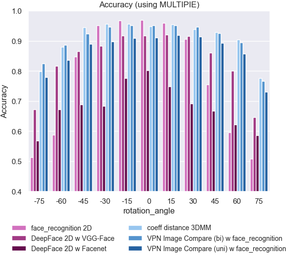

# Testing Pipeline to compare Face Recognition using novel 3D Based 3DMM Face Reconstruction Methods vs "old" 2D based methods

Bachelor Thesis

> [!NOTE]
> This Bachelor Thesis is only available in german yet.

Bachelor Thesis PDF available at:  https://alexander-ehrenhoefer.com/cloud/BA_Alexander_Ehrenhoefer_2024.pdf

 
This work is licensed under <a href="https://creativecommons.org/licenses/by-nc-sa/4.0/?ref=chooser-v1" target="_blank" rel="license noopener noreferrer" style="display:inline-block;">CC BY-NC-SA 4.0</a>
 

## Abstract

Die Thematik der Gesichtserkennung gilt als eine der wichtigsten im Bereich der Computer
Vision. Mit den bisher gängigen 2D Analyse Verfahren können unter den meisten Umständen
bereits sehr gute Ergebnisse erzielt werden. Doch die 2D basierte Gesichtserkennung stößt
bei Herausforderungen wie starken Abweichungen der Pose, Mimik oder Beleuchtung des zu
identifizierenden Gesichtes an ihre Grenzen. Neue Machine Learning basierte Verfahren
ermöglichen die 3D Gesichtsmodell Rekonstruktion anhand eines einzigen einfachen 2D
Gesichtsbildes (d.h. ohne jegliche Art von 3D Scans). Aus einfachen 2D Bildern werden somit
detaillierte 3D Modelle generiert, welche dann für Gesichtserkennungsverfahren angewendet
werden können. Im Rahmen dieser Arbeit werden die Möglichkeiten der 3D basierten
Gesichtserkennungsverfahren untersucht und umfassende Tests in unterschiedlichen
Szenarien mit mehreren großen Bild Datensätzen durchgeführt. Das Ziel ist es, die
Zuverlässigkeit klassischer 2D Gesichtserkennungsverfahren mit den neuen 3D basierten
Ansätzen zu vergleichen. Dafür werden unterschiedliche Ansätze der 3D Gesichtserkennung
behandelt und auch eigens programmiert, da noch keine öffentlich zugängliche
Implementation der verwendeten Verfahren existiert. Die Tests sollen durch eine
automatisierte und flexible Testing Pipeline umgesetzt werden, welche im Rahmen dieser
Arbeit konzipiert und aufgebaut wird. Schlussendlich sollen die Testergebnisse das Potenzial
der 3D Gesichtserkennung zeigen und untersuchen ob die Hürden der 2D Gesichtserkennung
damit überwunden werden können.

## Key Results
### Test T5: Head rotation, lighting and facial expression changes
For T6, all property groups defined in the bachelor thesis were combined, thus creating the most challenging
test conditions in this thesis. The multi-PIE dataset was used for testing.
